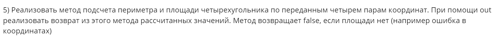

# ***Описание репозитория*** :book:
Здесь будет реализованы домашние задания на Java, по дисциплине **"Проектирование программной архитектуры"** 
# ***Авторы решений*** :star2:
## ***Степаниденко Денис и Матвей Пак*** :sparkles:

# Задание 1 :computer:
***1) Прочитать статью https://habr.com/ru/articles/144611/***

***2) Взять любое старое домашнее задание и отрефакторить его с точки зрения соблюдения трех принципов: DRY-KISS-YAGNI***

Мы использовали на практике рефактор кода с помощью принципа ***DRY*** 

Для начала посмотрим ***задание***:


Обратим внимание на старый код:
```java
package homeWorks.first.dry;

public class SquareAndPerimetrOld {

    /**
     * метод вычисляет периметр четырехугольника abcd
     *
     * @param a
     * @param b
     * @param c
     * @param d
     * @param result - значение периметра
     * @return - возвращает true, если периметр был успешно найден,
     * в противном случае возвращает false
     */
    public static boolean perimetr(Point a, Point b, Point c, Point d, Double result) {
        // Проверим, существует ли такой четырехугольник в начале
        boolean flagRectangleExists = isRectanglePossible(a, b, c, d);
        if (!flagRectangleExists) {
            result = null;
            return false;
        }

        double sideAB = getDistance(a, b);
        double sideBC = getDistance(b, c);
        double sideCD = getDistance(c, d);
        double sideDA = getDistance(d, a);
        result = sideAB + sideBC + sideCD + sideDA;
        return true;
    }

    /**
     * метод вычисляет площадь четырехугольника abcd
     *
     * @param a
     * @param b
     * @param c
     * @param d
     * @param result - значение площади
     * @return - возвращает true, если площадь была успешно найдена,
     * в противном случае возвращает false
     */

    public static boolean Square(Point a, Point b, Point c, Point d, Double result) {
        boolean flagRectangleExists = isRectanglePossible(a, b, c, d);
        if (!flagRectangleExists) {
            result = null;
            return false;
        }

        double sideAB = getDistance(a, b);
        double sideBC = getDistance(b, c);
        double sideCD = getDistance(c, d);
        double sideDA = getDistance(d, a);
        double sideBD = getDistance(b, d);

        double squareFirst = Heron(sideAB, sideBD, sideDA);
        double squareSecond = Heron(sideBC, sideCD, sideBD);
        result = squareFirst + squareSecond;
        return true;
    }

    /**
     * метод считает площадь треугольника по формуле Герона
     *
     * @param a
     * @param b
     * @param c
     * @return - возвращает значение площади треугольника
     */

    public static double Heron(double a, double b, double c) {
        double halfPerimetr = (a + b + c) / 2;
        return Math.sqrt(halfPerimetr * (halfPerimetr - a) * (halfPerimetr - b) * (halfPerimetr - c));
    }

    /**
     * метод вычисления расстояния между точками
     *
     * @param point1 - первая точка
     * @param point2 - вторая точка
     * @return - возвращает расстояние между точками
     */
    public static double getDistance(Point point1, Point point2) {
        return Math.sqrt(Math.pow(point1.getX() - point2.getX(), 2) + Math.pow(point1.getY() - point2.getY(), 2));
    }

    /**
     * метод определяет, возможно ли построить четырехугольник по четырем точкам
     * затем
     *
     * @param a
     * @param b
     * @param c
     * @param d
     * @return - true, если по данным четырем точкам можно построить четырехугольник,
     * в противном случае вернет false
     */

    public static boolean isRectanglePossible(Point a, Point b, Point c, Point d) {
        // вычислим длины сторон прямоугольника и одной его диагонали
        double sideAB = getDistance(a, b);
        double sideBC = getDistance(b, c);
        double sideCD = getDistance(c, d);
        double sideDA = getDistance(d, a);
        double sideBD = getDistance(b, d);

        // теперь проверим неравенства для двух треугольников,
        // образованных разделением четырехугольника по диагонали
        boolean flag1 = isTriangleRuleCompleted(sideAB, sideBD, sideDA);
        boolean flag2 = isTriangleRuleCompleted(sideBC, sideCD, sideBD);
        return flag1 && flag2;
    }

    /**
     * метод проверяет, выполняется ли неравенство треугольника
     *
     * @param side1 - первая сторона треугольника
     * @param side2 - вторая сторона
     * @param side3 - третья сторона
     * @return - вернет true, если неравенство треугольника выполняется,
     * в противном случае вернет false
     */
    public static boolean isTriangleRuleCompleted(double side1, double side2, double side3) {
        // проверяем 3 неравенства треугольника
        if (side1 + side2 < side3) return false;
        if (side2 + side3 < side1) return false;
        if (side1 + side3 < side2) return false;
        return true;
    }
}
```
Но что же в нём плохого ***по принципу DRY?*** :santa:

Заметим, что ***код*** далее:
```java
    double sideAB = getDistance(a, b);
    double sideBC = getDistance(b, c);
    double sideCD = getDistance(c, d);
    double sideDA = getDistance(d, a);
    double sideBD = getDistance(b, d);
```
повторяется в трёх методах. 

Это отличный шанс применить принцип ***DRY*** и создать отдельный метод для этого. :closed_book:

Далее приведён исправленный код :clapper:
```java
public class SquareAndPerimetrNew {
    /**
     * метод вычисляет периметр четырехугольника abcd
     *
     * @param a
     * @param b
     * @param c
     * @param d
     * @param result - значение периметра четырехугольника
     * @return - возвращает true, если периметр был успешно найден,
     * в противном случае возвращает false
     */
    public static boolean perimetr(Point a, Point b, Point c, Point d, Double result) {

        // Сначала проверим, существует ли такой четырехугольник
        boolean flagRectangleExists = isRectanglePossible(a, b, c, d);
        if (!flagRectangleExists) {
            result = null;
            return false;
        }

        // вычислим длины сторон четырехугольника
        var sides = getSidesAndDiagonal(a, b, c, d);

        // найдем периметр
        result = sides[0] + sides[1] + sides[2] + sides[3];
        return true;
    }


    /**
     * метод вычисляет площадь четырехугольника abcd
     *
     * @param a
     * @param b
     * @param c
     * @param d
     * @param result - значение площади четрыехугольника
     * @return - возвращает true, если площадь была успешно найдена,
     * в противном случае возвращает false
     */

    public static boolean Square(Point a, Point b, Point c, Point d, Double result) {

        // Сначала проверим, существует ли такой четырехугольник
        boolean flagRectangleExists = isRectanglePossible(a, b, c, d);
        if (!flagRectangleExists) {
            result = null;
            return false;
        }

        // вычислим длины сторон четырехугольника и одной его диагонали
        var sides = getSidesAndDiagonal(a, b, c, d);

        // теперь найдем площадь четырехугольника, используя формулу Герона
        double squareFirst = Heron(sides[0], sides[4], sides[3]);
        double squareSecond = Heron(sides[1], sides[2], sides[4]);
        result = squareFirst + squareSecond;
        return true;
    }

    /**
     * метод считает площадь треугольника по формуле Герона
     *
     * @param a
     * @param b
     * @param c
     * @return - возвращает значение площади треугольника
     */

    public static double Heron(double a, double b, double c) {
        double halfPerimetr = (a + b + c) / 2;
        return Math.sqrt(halfPerimetr * (halfPerimetr - a) * (halfPerimetr - b) * (halfPerimetr - c));
    }

    /**
     * метод вычисления расстояния между точками
     *
     * @param point1 - первая точка
     * @param point2 - вторая точка
     * @return - возвращает расстояние между точками
     */
    public static double getDistance(Point point1, Point point2) {
        return Math.sqrt(Math.pow(point1.getX() - point2.getX(), 2) + Math.pow(point1.getY() - point2.getY(), 2));
    }

    /**
     * метод получает длины сторон и диагонали четрыехугольника по его четырем вершинам
     *
     * @param a
     * @param b
     * @param c
     * @param d
     * @return - возвращает массив с длинами сторон и диагонали четырехугольника
     */
    public static double[] getSidesAndDiagonal(Point a, Point b, Point c, Point d) {
        double[] sidesAndDiagonal = new double[5];
        sidesAndDiagonal[0] = getDistance(a, b);
        sidesAndDiagonal[1] = getDistance(b, c);
        sidesAndDiagonal[2] = getDistance(c, d);
        sidesAndDiagonal[3] = getDistance(d, a);
        sidesAndDiagonal[4] = getDistance(b, d);

        return sidesAndDiagonal;
    }

    /**
     * метод определяет, возможно ли построить четырехугольник по четырем точкам
     * затем
     *
     * @param a
     * @param b
     * @param c
     * @param d
     * @return - true, если по данным четырем точкам можно построить четырехугольник,
     * в противном случае вернет false
     */
    public static boolean isRectanglePossible(Point a, Point b, Point c, Point d) {
        // вычислим длины сторон четырехугольника и одной его диагонали
        var sides = getSidesAndDiagonal(a, b, c, d);

        // теперь проверим неравенства для двух треугольников,
        // образованных разделением четырехугольника по диагонали
        boolean flag1 = isTriangleRuleCompleted(sides[0], sides[4], sides[3]);
        boolean flag2 = isTriangleRuleCompleted(sides[1], sides[2], sides[4]);
        return flag1 && flag2;
    }

    /**
     * метод проверяет, выполняется ли неравенство треугольника
     *
     * @param side1 - первая сторона треугольника
     * @param side2 - вторая сторона
     * @param side3 - третья сторона
     * @return - вернет true, если неравенство треугольника выполняется,
     * в противном случае вернет false
     */
    public static boolean isTriangleRuleCompleted(double side1, double side2, double side3) {
        // проверяем 3 неравенства треугольника
        if (side1 + side2 < side3) return false;
        if (side2 + side3 < side1) return false;
        if (side1 + side3 < side2) return false;
        return true;
    }
}
```

Как мы видим, был создан новый метод, который по введённым точкам - определяет все стороны и диагональ четырёхугольника :diamonds:
```java
 public static double[] getSidesAndDiagonal(Point a, Point b, Point c, Point d) {
        double[] sidesAndDiagonal = new double[5];
        sidesAndDiagonal[0] = getDistance(a, b);
        sidesAndDiagonal[1] = getDistance(b, c);
        sidesAndDiagonal[2] = getDistance(c, d);
        sidesAndDiagonal[3] = getDistance(d, a);
        sidesAndDiagonal[4] = getDistance(b, d);

        return sidesAndDiagonal;
    }
```


